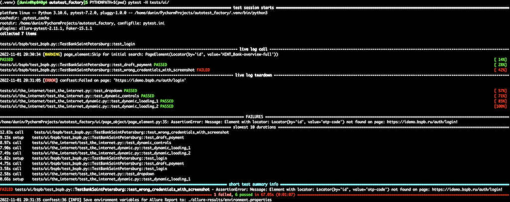
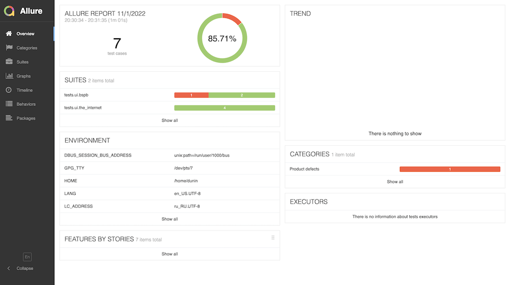
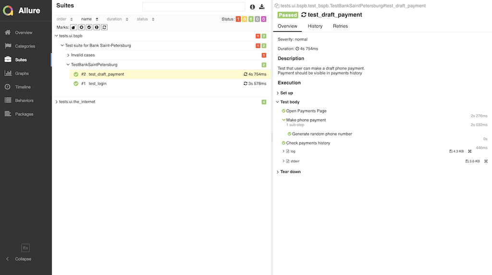

# Autotest Factory
This repository contains very simple PageObject implementation with test examples for two test sites:
1. https://idemo.bspb.ru/ 
2. https://the-internet.herokuapp.com/

Using this repo you can easily start your own UI E2E test automation, which will be fast enough and reliable. Also,
you will be able to extend this framework with your own features, using current structure.

## Main Used Packages
1. Selenium (https://selenium-python.readthedocs.io/)
2. Pytest (https://docs.pytest.org/en/7.2.x/)
3. Allure-Pytest (https://github.com/allure-framework/allure-python/tree/master/allure-pytest)
4. Faker (https://faker.readthedocs.io/en/master/)

##  How to run tests
First you need to install **Python 3.7** or above, **pip** (Python package manager) and **venv** (Virtual environment library for Python).

### Download source code and prepare env
NB: this will work on Linux/MacOS.
```shell
# Clone repository
git clone git@github.com:ivdunin/autotest_factory.git
cd autotest_factory

# Enable virtualenv
python3 -m venv .venv
source .venv/bin/activate

# Install Python requirements
pip install -r requirements.txt
```
It is better to use VirtualEnv package to keep your local environment clean and safe.

### Download ChromeDriver
1. Download ChromeDriver from https://chromedriver.chromium.org/downloads for your OS and Chrome (Chromium) version.
2. Unzip archive and place file under your `PATH` environment or to `autotest_factory` dir.

or 

It is possible **WebDriver Manager for Python** (https://pypi.org/project/webdriver-manager/) to install ChromeDriver/Gekodriver/etc automatically.

### Run tests
Make sure your VirtualEnv is enabled
```shell
PYTHONPATH=$(pwd) pytest --headless tests/ui/
```


Should be one failed test, to check that screenshot is always taken on failure.

### Prepare report
1. Install Allure: https://docs.qameta.io/allure-report/#_installing_a_commandline
2. Prepare Allure Report:
```shell
cd autotest_factory
allure generate --clean && allure open
```



## Project structure
```shell
.
├── config
├── tests
│   └── ui
│       ├── bspb
│       └── the_internet
└── ui
    ├── page_object
    │   └── expected_condition
    └── pages
        ├── bspb
        │   └── payments
        └── the_internet
```

* [config](config) ─ stores framework and tests configuration for different environments (read it here: https://github.com/ivdunin/app_settings#readme)
* [tests](tests) ─ the place where all tests should be placed (UI/API)
* [ui/page_object](ui/page_object) ─ the library for UI automation. Contains PageObject implementation itself and PageElement/PageElements classes.
* [ui/page_object/expected_condition](ui/page_object/expected_condition) ─ custom expected conditions. 
* [ui/pages](ui/pages) ─ application specific page objects.

### Project files description
* [tests/ui/conftest.py](tests/ui/conftest.py) ─ fixtures to configure WebDriver and Faker package.
* [tests/ui/hooks.py](tests/ui/hooks.py) ─ pytest hooks for: report configuration, additional command line parameters, loggers configuration.
* [ui/page_object/base_page.py](ui/page_object/base_page.py) ─ base class for all PageObjects. Contains all methods which relates to web page.
* [ui/page_object/page_element.py](ui/page_object/page_element.py) & [ui/page_object/page_elements.py](ui/page_object/page_elements.py) ─ PageElement and PageElements implementation.
Is used to describe and interact with elements of web page.
* [ui/page_object/locator.py](ui/page_object/locator.py) ─ convenient methods to describe elements locator (`by_css`, `by_id`, etc)

## TODO:
1. Boilerplate code for API automation
